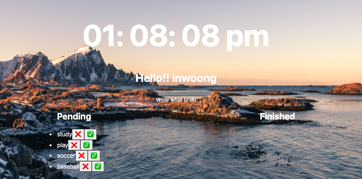
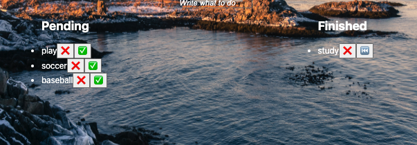

# NomadCoder 강의 및 코드내용 정리

## VanilaJS (lecture, Challenge)

[github 페이지]("https://github.com/in-woong/NomadCoder/tree/main/vanilaJS_basic")

### 구현 기능

- 웹페이지 시작페이지로 TodoList, Clock, 위치를 표시할 수 있는 기능을 구현하며, 배경화면을 랜덤하게 변경하는 페이지 구현
- JS Clock
  
  - 시간 기능 구현
- JS TO DO List
  
  - todolist 입력
  - 진행중, 완료 체크 리스트 구현
- GET Geolocation

  

  - geolocation 값 받아와서 표현하는 기능 구현

- GET Weather information
  - 받아온 geol값을 활용하여 weather 값 표시하는 기능 구현

## Python (lecture, Challenge)

## NodeJS (lecture, Challenge)

## ReactJS

## Redux

## TypeScript (진행중)
