# NomadCoder 강의 및 코드내용 정리

## VanilaJS (lecture, Challenge)

[github 페이지]("https://github.com/in-woong/NomadCoder/tree/main/vanilaJS_basic")

### 구현 기능

- 웹페이지 시작페이지로 TodoList, Clock, 위치를 표시할 수 있는 기능을 구현하며, 배경화면을 랜덤하게 변경하는 페이지 구현
- JS Clock
  
  - 시간 기능 구현
- JS TO DO List
  
  - todolist 입력
  - 진행중, 완료 체크 리스트 구현
- GET Geolocation

  

  - geolocation 값 받아와서 표현하는 기능 구현

- GET Weather information
  - 받아온 geol값을 활용하여 weather 값 표시하는 기능 구현

### Challenge

## Python (lecture, Challenge)

### 구현기능

- Stack Overflow Jobs Scrapping
- Indeed Jobs Scrapping
- Web Server
- Search Feature
- Export to CSV

## NodeJS (lecture, Challenge)

### 구현기능

- Youtube Frontend 화면 구성(github 이동 간 삭제)
- Youtube Server 구성
  [Server Github page]("https://github.com/in-woong/NomadCoder/tree/main/NodeJS_basic")

#### Users

- User Authentication
- Facebook Login
- Github Login
- User Profile
- Log in
- Log Out

#### Videos

- Video Upload
- Video Recording
- Search Video
- AJAX Comments
- View Count

#### Deployment

- Heroku
- S3 Upload
- Mongo Atlas

#### Theory

- MVC
- Routing
- Templates
- Models
- Relationiships

## ReactJS

### Netflix Clone coding

- 메인화면
  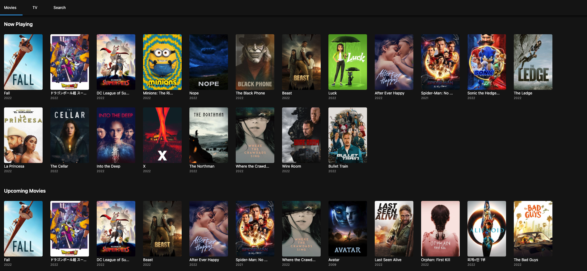
- 상세화면
  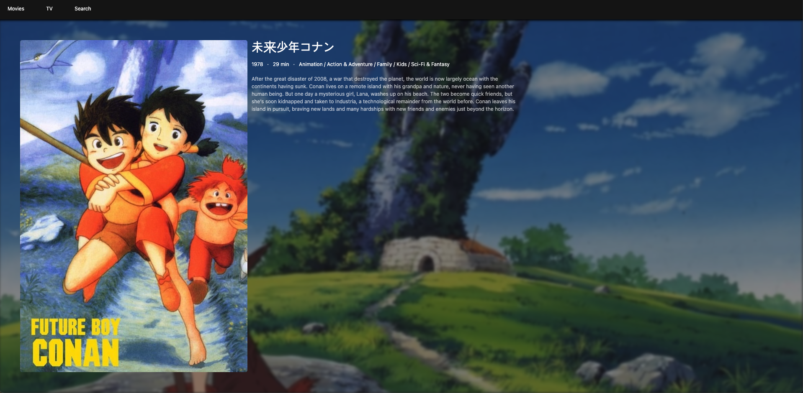
- 검색화면
  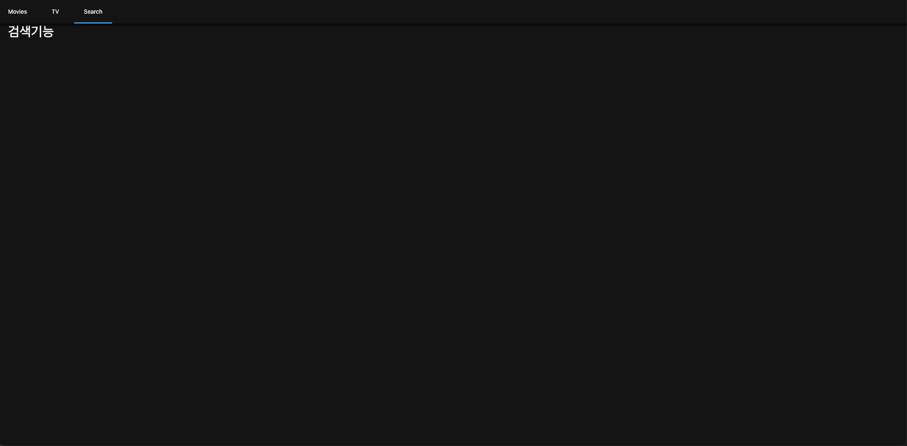

### 암호화폐 시세 트래커

> React Query 사용을 중점

 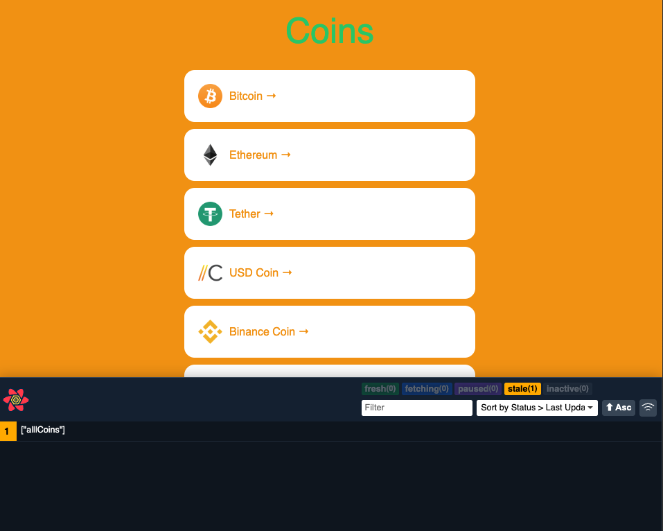
 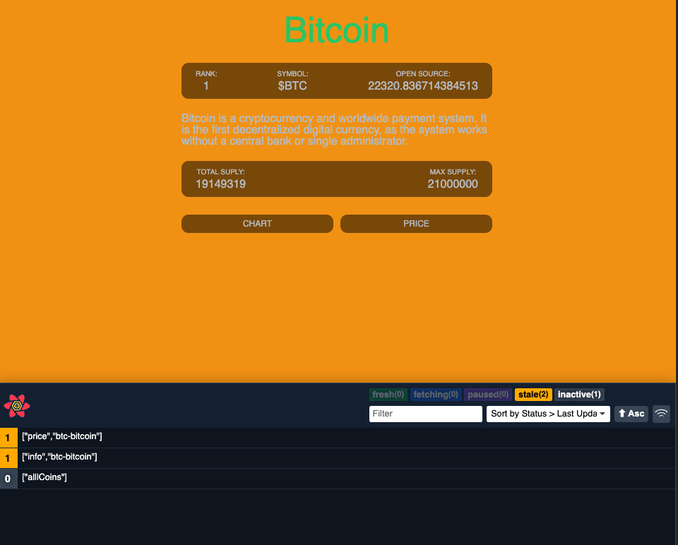

- Data Fetching
- Data Visualization
- Routing
- Dark Monde

### 트렐로 클론코딩 (진행중)

- Form Validation
- Drag and Drop
- State management

### 모션프로젝트 (진행중)

- Animation
- Sliders
- Modals

## Redux

> redux를 통한 Todo list를 통해 상태관리 하는 방법 습득

## TypeScript

> 기본 지식 습득

# Challenge

- HTML CSS (카카오톡 클론 코딩)

  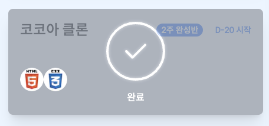

- Vanila JS

  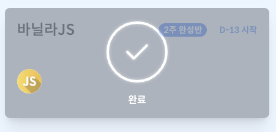

- CSS Layout

  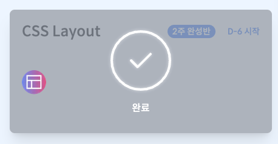

- Python

  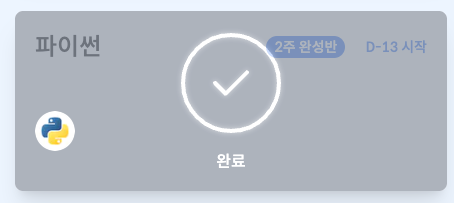

- React JS

  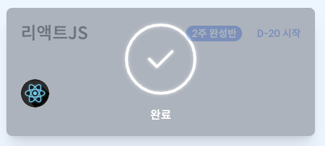

- Youtube Clonecoding

  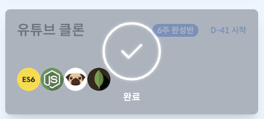

- Airbnb Clonecoding

  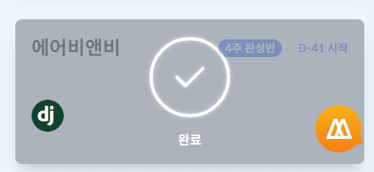
